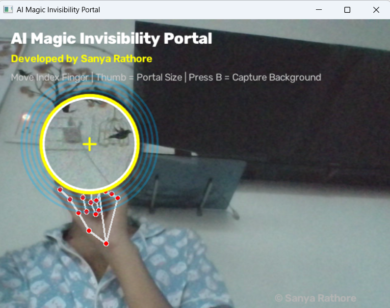

<p align="center">
  
</p>

# ✨ AI Magic Invisibility Portal

A real-time AI-powered invisibility portal built using **Python**, **OpenCV**, and **MediaPipe**. The portal follows the user's index finger, dynamically changes size based on finger distance, and reveals the captured background inside the portal to create a magical invisibility effect.

---

## 🚀 Features

- 🪄 Real-time hand tracking using MediaPipe
- 🎯 Portal follows the index finger
- 📏 Dynamic portal size controlled by thumb-index distance
- ✨ Smooth portal movement
- 🌟 Glowing portal effect
- 👻 Real-time invisibility illusion
- ⚡ Fast performance using OpenCV

---

## 🛠️ Technologies Used

- Python
- OpenCV
- MediaPipe
- NumPy

---

## 📂 Project Structure

```
AI-Magic-Invisibility-Portal/
│
├── main.py
├── portal.py
├── requirements.txt
├── README.md
└── screenshots/
```

---

## ⚙️ Installation

### 1. Clone the repository

```bash
git clone https://github.com/YOUR_GITHUB_USERNAME/AI-Magic-Invisibility-Portal.git
```

### 2. Open the project

```bash
cd AI-Magic-Invisibility-Portal
```

### 3. Create a virtual environment

```bash
python -m venv venv
```

### 4. Activate it

Windows

```bash
venv\Scripts\activate
```

### 5. Install dependencies

```bash
pip install -r requirements.txt
```

### 6. Run

```bash
python main.py
```

---

## 📸 Demo

### Magic Portal

> Add screenshots inside the **screenshots** folder.

Example:

```
screenshots/
    portal_demo1.png
    portal_demo2.png
```

---

## 🎯 Future Improvements

- Animated energy portal
- Particle effects
- Multiple portals
- Gesture-based controls
- Portal color customization
- Background stabilization

---

## 👩‍💻 Developer

**Sanya Rathore**

GitHub: https://github.com/sanya-1612

---

## ⭐ Support

If you like this project, consider giving it a ⭐ on GitHub.